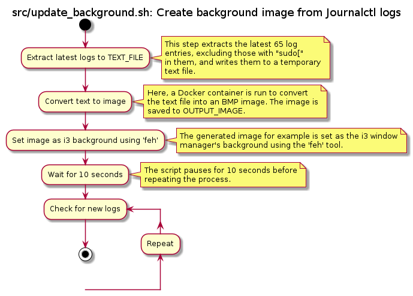

# text-to-bmp
Create background image from text file (Journalctl logs)

Requirements:
- Linux
- Docker or Podman
- feh (image viewer)

Use cases:
- Read live updated journalctl logs on your Linux desktop background
- Convert textfile to bmp image format

Provides:
- Docker container "text-to-bmp"
- Docker container "plantuml" for the docs

Docs - Overview

Docs - update_background script

